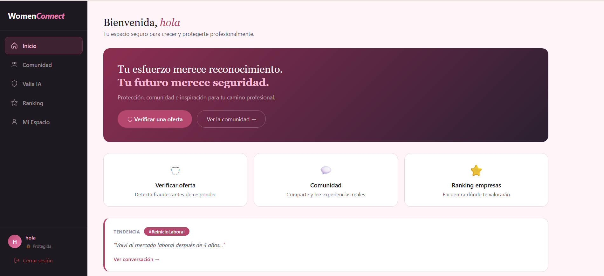
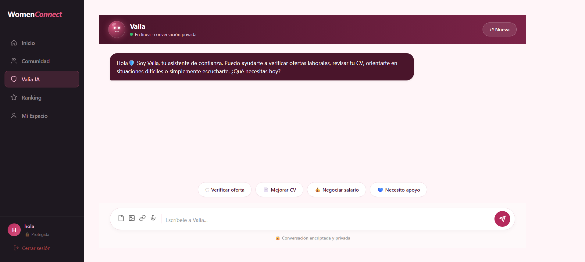

# Misty.pe – WomenConnect

## Overview

WomenConnect is a web and mobile platform created by Peruvian women to address workplace risks such as digital job scams, toxic environments, discrimination, and lack of reliable information. Developed by the startup Misty.pe, the platform combines community, transparency, and artificial intelligence to empower women in their professional journey.

---

## Project Preview

### Home Screen

### Valia AI – Intelligent Support Center

---

## The Problem

Women in Peru face multiple structural and cultural barriers:

- Gender wage gap (20–30% depending on the sector)
- Digital job scams requesting payments or personal data
- Unsafe or discriminatory work environments
- Lack of transparent information about companies
- Social expectations that limit professional growth

These challenges create fear, misinformation, and unsafe decision-making.

---

## Proposed Solution

WomenConnect provides a safe, collaborative ecosystem that includes:

- A digital community with anonymous reviews
- A company ranking system based on real experiences
- An AI assistant (Valia) that:
  - Verifies job offers and detects fraud
  - Analyzes contracts and suspicious messages
  - Improves résumés (ATS‑friendly)
  - Offers emotional support and professional guidance
- A personal dashboard with saved companies, reviews, and risk analyses

---

## Key Features

### Motivational Home
Empowering messages and quick access to the Community and Support Center.

### Community
A safe space to share workplace experiences with:
- Anonymous posting
- Filters and tags
- Content reporting
- Verification steps to ensure authenticity

### Valia – Intelligent Support Center
- Verify Offer: Detects fraud patterns and risk signals  
- Need Support: Emotional and preliminary legal guidance  
- Improve My CV: Highlights achievements and optimizes for ATS  
- Negotiate My Salary: Personalized scripts and data-based arguments  

### Company Ranking
Ratings based on:
- Pay equity  
- Work-life balance  
- Safety and respect  
- Growth opportunities  

Includes anonymous reviews and green/red flag tags.

### My Safe Space
A private dashboard showing:
- User occupation
- Saved companies
- Saved job offer analyses
- Published reviews
- Impact metrics (such as women helped)

---

## Target Audience

- Peruvian women aged 18–45+ seeking employment, career change, or reintegration
- Companies aiming to improve their culture and attract female talent

---

## Value Proposition and Differentiation

| Platform        | Similarities                                   | Differences                                                  | Best Problem Solved                                         |
|-----------------|------------------------------------------------|--------------------------------------------------------------|--------------------------------------------------------------|
| Glassdoor       | Company reviews                                | Not focused on women or risk detection                      | General labor transparency                                   |
| Indeed          | Job listings and CV tools                      | No exclusive community or fraud analysis                    | Job search                                                   |
| LinkedIn        | Networking and company insights                | No anonymity or scam detection                              | Professional networking                                      |
| WomenConnect    | Exclusive community, AI, anonymous reviews     | Specialized in women’s workplace risks                      | Fraud prevention, empowerment, and safe decision-making      |

---

## Technologies Used

- HTML, CSS, JavaScript (navigable prototype)
- GitHub Pages for deployment
- Simulated AI (Valia) in this initial phase

---

## Prototype Structure

- Simulated login interface  
- Company ranking system with demo reviews  
- Multi-step review submission form  
- Valia chatbot with simulated functionalities  

---

## Visual Identity and Design

### Color Palette
- Very light pink — `#fff5f8`
- Light pink — `#F5B8D0`
- Medium pink — `#e87aae`
- Dark pink — `#b5476e`
- Deep purple — `#8c2e52`
- Black — `#000000`

### Typography
- Segoe UI, Arial, sans-serif  
Chosen for clarity, accessibility, and professionalism.

### Design Principles
- Empathy and warmth  
- Accessible professionalism  
- Clarity and simplicity  
- Representation and purpose  

---

## How to Contribute

1. Review open issues in the repository  
2. Suggest improvements in UX, AI, or security  
3. Share workplace experiences to enrich the community  
4. Submit pull requests with documented enhancements  

---

## Team Credits

- Luz Margarita Cahuana López  
- María Fernanda Hallasi Yucra  
- Nicole Virginia Castillón Rucana  
- Milene Vásquez Quispe

---

## Created by Misty.pe
Technology with purpose — built by women, for women.